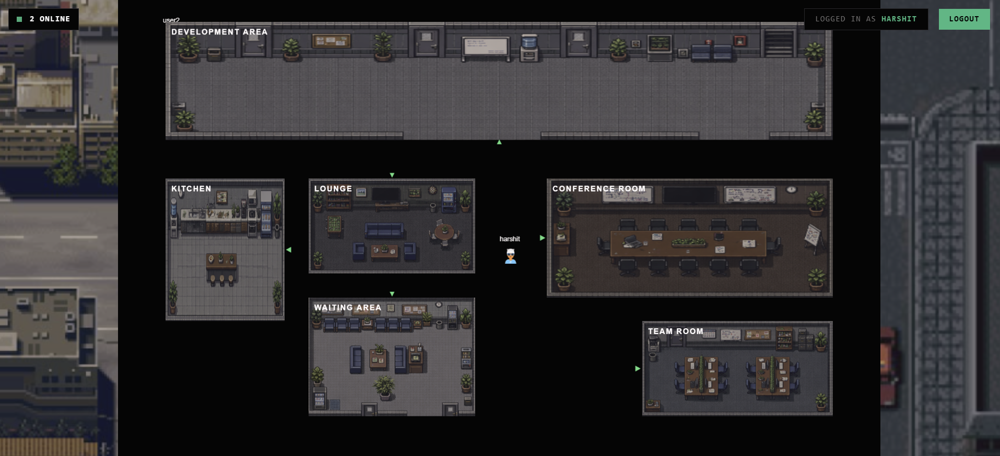

# Virtual Cosmos

## Overview
Virtual Cosmos is a proximity-based real-time 2D shared collaboration environment. Designed as a modern virtual office, it allows users to navigate a digital space, converse naturally via proximity chat, and interact in real-time, simulating the dynamics of a physical workspace.

## Key Features
* Real-Time Movement: Navigate freely in a shared 2D environment and see colleagues move instantly through WebSockets.
* Proximity Chat: Conversations spark naturally. Text chat panels open automatically when users walk near each other.
* Environment Physics: Includes line-of-sight checks to prevent chat interactions through walls, as well as collision boundaries restricting player movements.
* Dedicated Office Zones: Features specific designated areas such as the Development Area, Kitchen, Lounge, Conference Room, and Team Room, using custom integrated graphic assets.
* Persistent Identity: Profile generation and secure JSON Web Token (JWT) based authentication.
* Seamless Hot Module Replacement (HMR): The React frontend is decoupled from the PixiJS canvas destruction cycle, allowing developers to save and reload the UI without resetting the canvas state.

## Technical Stack

### Frontend (Client)
* Framework: React.js (Bootstrapped with Vite)
* Styling: TailwindCSS
* Rendering Engine: PixiJS (v8) for high-performance 2D WebGL graphics.
* Real-time Communication: Socket.io-client

### Backend (Server)
* Environment: Node.js
* Framework: Express.js
* Real-time Engine: Socket.io
* Authentication: bcrypt, jsonwebtoken (JWT)

## Project Architecture

### 1. Canvas and Rendering (PixiApp.js)
The environment consists of a *1600x1000* coordinate system rendered via PixiJS. The map uses helper functions to define regions, establish solid obstacle boundaries, set overlay navigational arrows, and bind custom asynchronous image assets. The canvas automatically scales to wide monitors via CSS constraints while preserving its native aspect ratio.

### 2. Player Movement and Interpolation (PlayerManager.js)
Movement commands are captured using standard WASD or arrow keys. To prevent network flooding, the local coordinates are throttled before being emitted to the backend. For remote players, coordinate updates are broadcast via Socket.io and smoothed out using Linear Interpolation (LERP) algorithms to eliminate visual stutter.

### 3. Proximity Engine (ProximityEngine.js)
Calculates distances between the local player and remote peers continuously. Once a player enters a designated pixel radius, a line-of-sight algorithm executes a bounding-box segment collision test against the physical wall arrays. If no walls obstruct the path, the engine establishes a direct Socket.io communication room.

## Installation and Setup

### Prerequisites
* Node.js (v18 or higher)
* npm

### Server Setup
1. Open a terminal and navigate to the `server` directory.
2. Run `npm install` to download dependencies.
3. Start the background process using `node index.js`.
4. The server runs on port 3001 by default.

### Client Setup
1. Open a terminal and navigate to the `client` directory.
2. Run `npm install` to download dependencies.
3. Start the Vite development server using `npm run dev`.
4. The frontend will be accessible at http://localhost:5173.

## Deployment Guidelines
The frontend and backend should be decoupled for production deployment:
* The `client` directory produces a static bundle via `npm run build`, which should be hosted on a global CDN.
* The `server` directory requires a stateful Node.js container that supports continuous WebSockets to maintain player location states.
